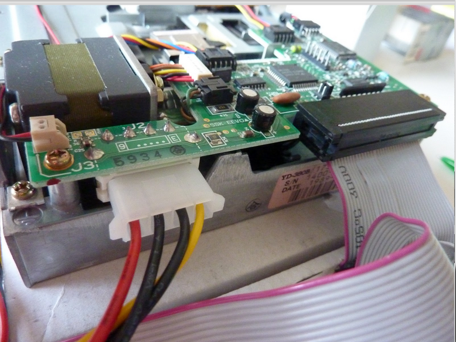
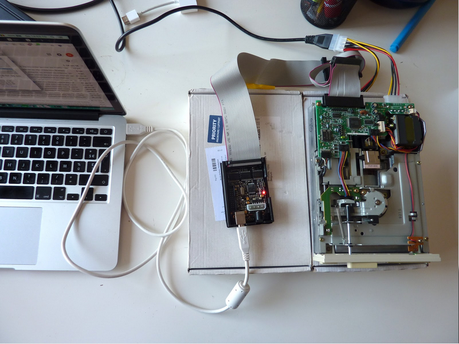

# 5,25 inch Floppy Disks

## Hardware

### Floppy Disk Drive

|**Model**|YE Data YD-380B|
|:--|:--|
|**Media**|5,25 inch floppy disks|
|**Interface**|[IDC](https://www.wikidata.org/wiki/Q374830)|
|**Connector**|Floppy|
|**Cable**|[Floppy Data Cable](https://www.computerhope.com/jargon/f/flopcabl.htm)|
|**Workstation connection**|via [Floppy Disk Controller](https://www.wikidata.org/wiki/Q741867)|
|**Power**| Power Supply unit and Molex-Y cable|
|**Documentation**| [manual](http://www.vintagecomputer.net/fjkraan/comp/divcomp/doc/YE_Data_YD-380_5.25inchHHHDFloppy.pdf) |

**Model**|IBM YD-380|
|:--|:--|
|**Media**|5,25 inch floppy disks|
|**Interface**|[IDC](https://www.wikidata.org/wiki/Q374830)|
|**Connector**|Floppy|
|**Cable**|[Floppy Data Cable](https://www.computerhope.com/jargon/f/flopcabl.htm)|
|**Workstation connection**|via [Floppy Drive Controller](https://www.wikidata.org/wiki/Q741867)|
|**Power**| Power Supply unit and Molex-Y cable|
|**Documentation**| [manual](http://www.vintagecomputer.net/fjkraan/comp/divcomp/doc/YE_Data_YD-380_5.25inchHHHDFloppy.pdf) |

### Floppy Drive Controller

|**Model**|Kryoflux Personal Edition Premium|
|:--|:--|
|**Media**|Drives with floppy data cable|
|**Interface**|[USB](https://www.wikidata.org/wiki/Q42378)|
|**Connector**|USB 2.0|
|**Cable**| USB type A |
|**Power**| n/a (via USB interface)|
|**Documentation**| [Archivist's Guide to Kryoflux](https://github.com/archivistsguidetokryoflux/archivists-guide-to-kryoflux) |

## Software

[Kryoflux DTC](https://www.kryoflux.com/?page=download) and Kryoflux GUI (manual: [Archivist's Guide to Kryoflux](https://github.com/archivistsguidetokryoflux/archivists-guide-to-kryoflux))

## Workflow

__!IMPORTANT!__ An internal floppy drive is an unstable source of power that can permanently damage the floppy drive controller, follow the correct order when connecting/disconnecting KryoFlux

### Connect the internal floppy drive to workstation

1. Place the floppy drive controller on a non-conductive surface, e.g. on a piece of cardboard
2. Connect the floppy disk drive to the floppy drive controller via the floppy data cable (wider adapter)

3. Connect the floppy drive controller to the workstation via the USB type A cable
4. Connect the floppy drive to the power supply via the Molex-Y cable (wider adapter plug)

5. Plug the power into an outlet

### Let the workstation communicate with the Floppy Drive

1. Open the Kryoflux GUI software
2. Choose _Drive_ in the menu en _Calibrate_ the drive

### Prepare the floppy disk

1. Cover the right notch on the floppy disk to disable writing on the floppy disk
