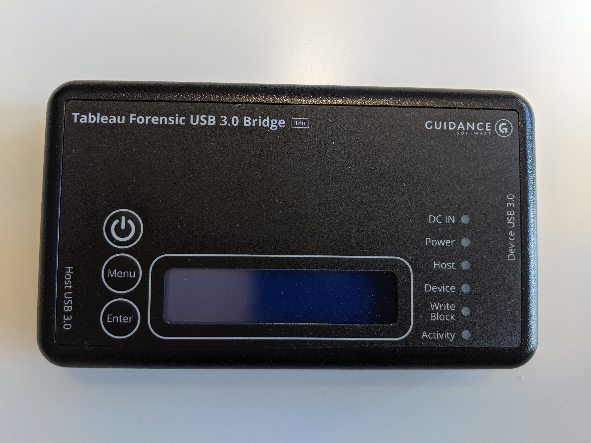
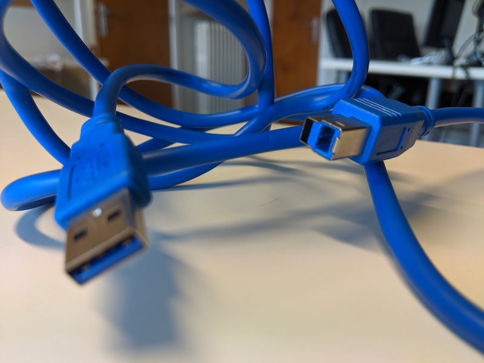
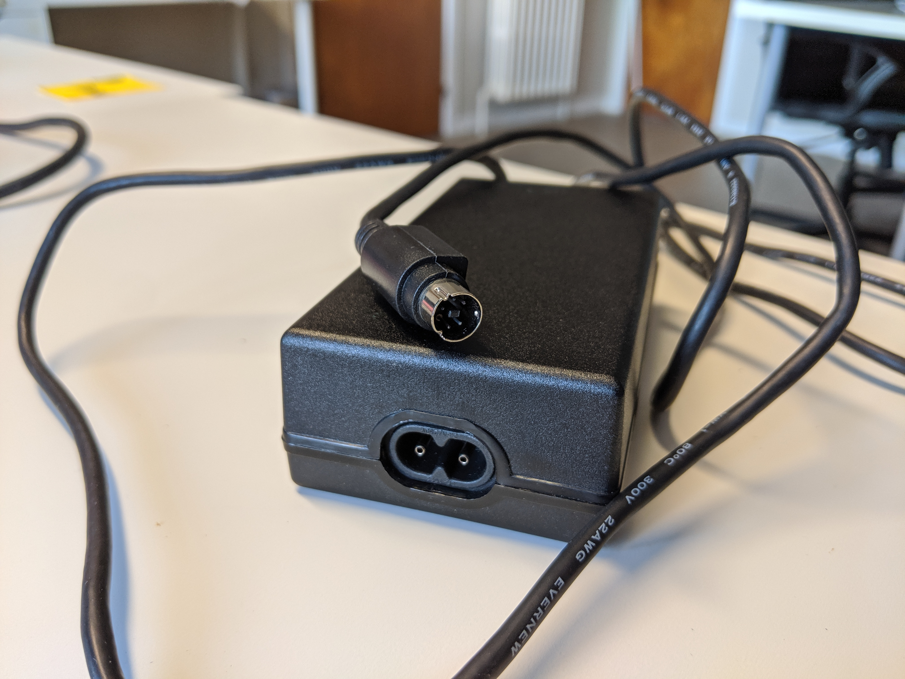
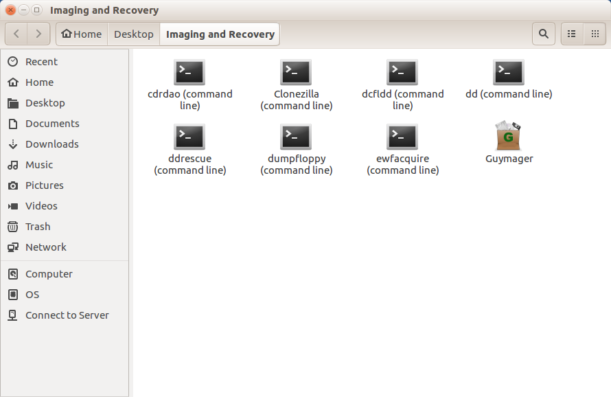
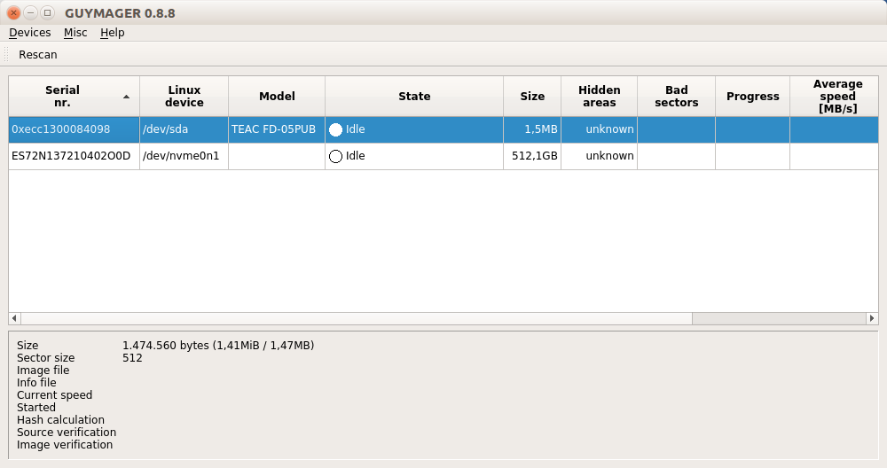
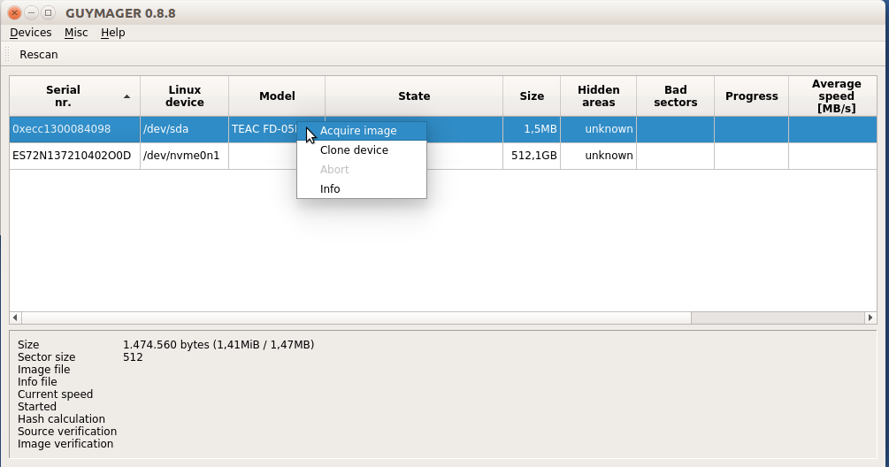
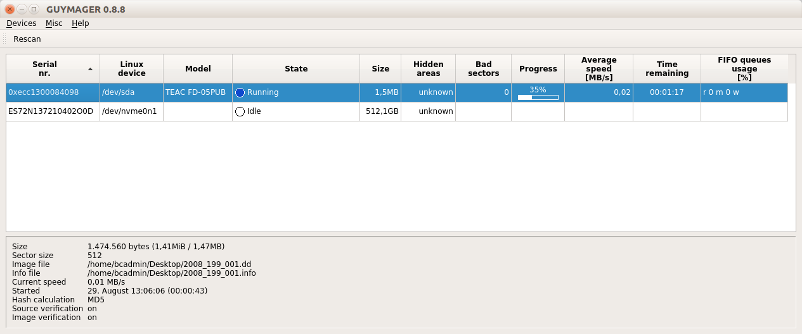
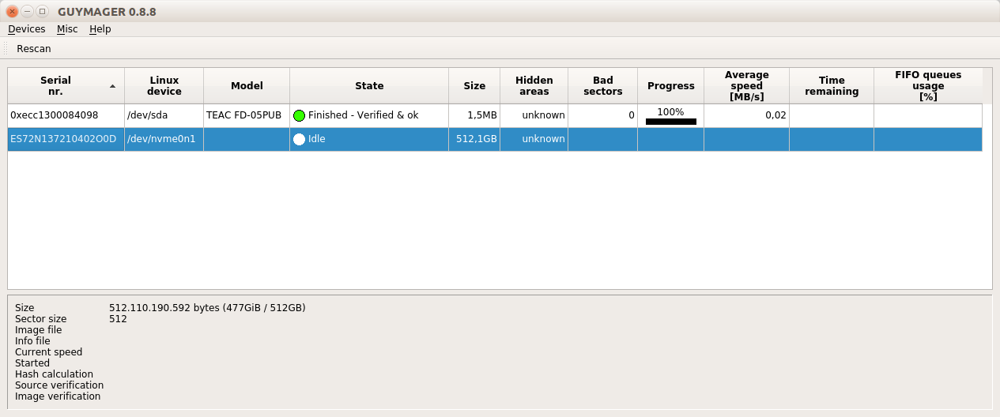
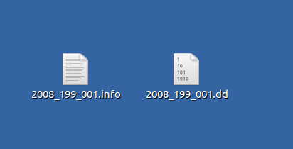
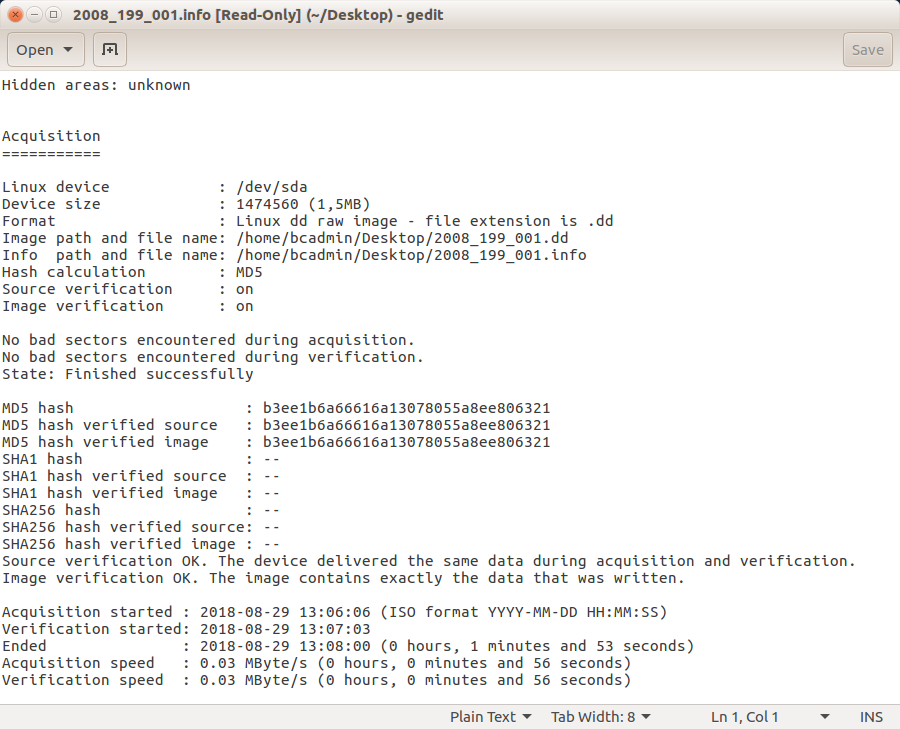

# Imitiation SuperDisk

## Hardware

### SuperDisk drive

|**Model**|[Imitation SuperDisk USB drive](https://web.archive.org/web/20150813195555/http://www.cnet.com/products/imation-superdisk-ls-120-superdisk-drive-usb-series/specs/) |
|:--|:--|
|**Media**|SuperDisk LS-120 and 3.5 inch floppy disk|
|**Interface**|[IDE](https://www.wikidata.org/wiki/Q230360)|
|**Connector**|IDE|
|**Cable**|IDE to USB cable|
|**Workstation connection**|Can be connected directly with write blocker|
|**Power**| power supply unit |
|**Documentation**| |

### Write blocker

|**Model**|[Tableau Forensic USB 3.0 Bridge T8U](https://web.archive.org/web/20180409191526/https://www.guidancesoftware.com/tableau/hardware//t8u) |
|:--|:--|
|**Media**|Drives with USB 3.0 and older connectors|
|**Interface**|[USB](https://www.wikidata.org/wiki/Q42378)|
|**Connector**|USB 3.0|
|**Cable**|[USB type B to USB type A](https://commons.wikimedia.org/wiki/Category:USB_cables?uselang=nl#/media/File:A-B_Usb_Cable.jpg) |
|**Workstation connection**|Can be connected directly with workstation (which has a USB type A female connection|
|**Power**| DC input: 5-pin Mini-DIN connector |
|**Documentation**| |

### Workstation

A Linux computer, preferably running the [Bitcurator Environment](https://bitcurator.net/) (We use a dual boot Dell XPS)

## Software

[Guymager](https://guymager.sourceforge.io/) in the [Bitcurator Environment](https://bitcurator.net/)

## Workflow

### Step 1: Connect the write blocker to the workstation

1. Connect the write blocker to the workstation using the blue USB 3.0 cable (Host USB 3.0)
2. Connect the DC power supply to the write blocker (bottom)
3. Plug the power cable into a power socket
4. Press the power button on the write blocker

### Step 2: Connect the SuperDisk drive to the write blocker

1. Connect the SuperDisk Drive to the write blocker using the USB cable (Device USB 3.0)
2. Connect the DC power supply to the SuperDisk Drive
3. Plug the power cable into a power socket

### Step 3: Prepare the disk

1. Grab the disk of which you want to capture the content
2. Slide the switch on the disk bringing it in read-only state

### Step 4: Create a disk image

1. Insert the SuperDisk in the SuperDisk Drive
2. Start **Guymager**. You will find Guymager in the _Imaging and Recovery_ folder of _Desktop_
   
3. Right click on the entry for the SuperDisk Drive and select _Acquire image_. You will find the SuperDisk Drive entry under the Linux device (second column) `/dev/sda`
    
    
4. Add following settings in the dialog:
   - **Linux dd raw image** as file format
   - **uncheck** the **Split image files**
   - under _Destination_ create a destination directory for the disk image by clicking on the button with **...**
   - enter a file name for the disk image file in the **Image filename (without extension)** field
   - under _Hash calculation/verification_ check **Calculate MD5** and **Verify image after acquisition**
5. Press the start button. Guymager wil start acquiring and verifying the image
    
6. When Guymager is finished, you'll see a green bullet and the text _Finished - Verified & ok_
   
7. Navigate to the chosen destination directory in step 4. You will see two files: a disk image with the _.dd_ extension and an information file with the _.info_ extension

### Step 5: Eject the disk

1. Open a file explorer window
2. Right click on the device in the left navigation sidebar
3. Select eject
4. Go back to step 3 using a new disk
