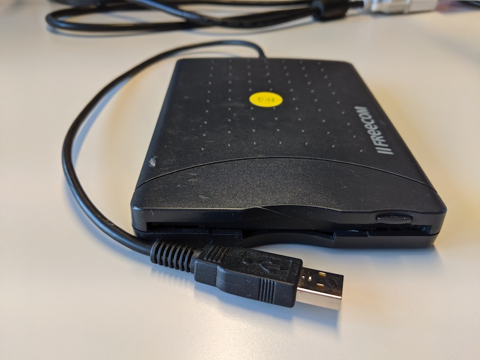
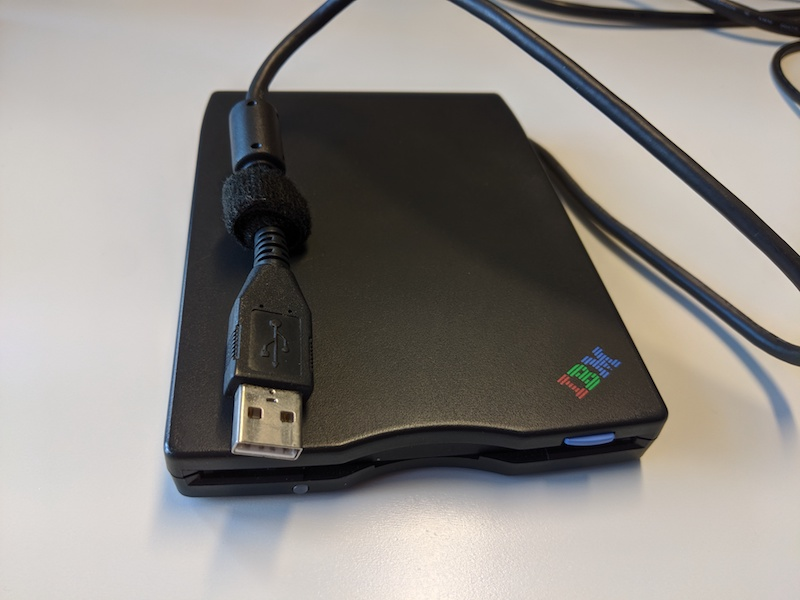
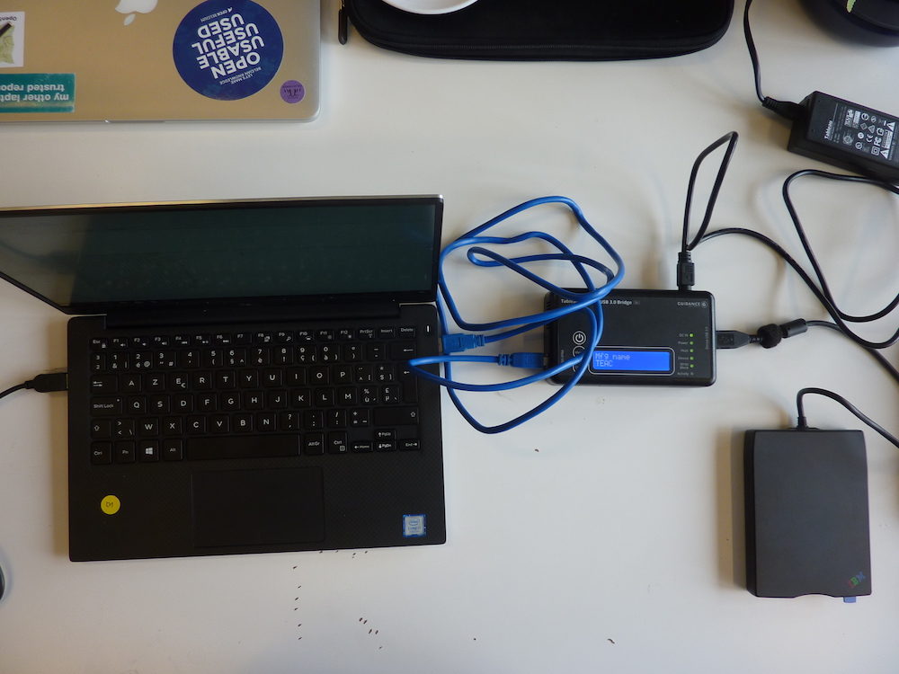
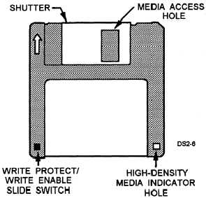

# 3,5 inch high density diskette

## Hardware

### Floppy drive

|**Model**|[Freecom USB Floppy Disk Drive](https://web.archive.org/web/20040803215730fw_/http://www.freecom.com/ecProduct_detail.asp?ID=1203&nr=22767&prodn=USB+Floppy+Disk+Drive) |
|:--|:--|
|**Media**|3,5 inch HD floppies (maybe also be double density ones used on Windows computers)|
|**Interface**|[USB](https://www.wikidata.org/wiki/Q42378)|
|**Connector**|USB 1.1|
|**Cable**|n/a - built in|
|**Workstation connection**|Can be connected directly with write blocker (which has a USB type A female connection|
|**Power**| n/a |
|**Documentation**| |

|**Model**|IBM Diskette Drive Portable 13N6752 |
|:--|:--|
|**Media**|3,5 inch HD floppies (maybe also be double density ones used on Windows computers)|
|**Interface**|[USB](https://www.wikidata.org/wiki/Q42378)|
|**Connector**|USB 1.1 or 2.0|
|**Cable**|n/a - built in|
|**Workstation connection**|Can be connected directly with write blocker (which has a USB type A female connection|
|**Power**| n/a |
|**Documentation**| |

### Write blocker

|**Model**|[Tableau Forensic USB 3.0 Bridge T8U](https://web.archive.org/web/20180409191526/https://www.guidancesoftware.com/tableau/hardware//t8u) |
|:--|:--|
|**Media**|Drives with USB 3.0 and older connectors|
|**Interface**|[USB](https://www.wikidata.org/wiki/Q42378)|
|**Connector**|USB 3.0|
|**Cable**|[USB type B to USB type A](https://commons.wikimedia.org/wiki/Category:USB_cables?uselang=nl#/media/File:A-B_Usb_Cable.jpg) |
|**Workstation connection**|Can be connected directly with workstation (which has a USB type A female connection|
|**Power**| DC input: 5-pin Mini-DIN connector |
|**Documentation**| [user guide](https://web.archive.org/web/20230308061552/https://manuals.plus/opentext/t8u-tableau-forensic-usb-bridge-manual)|

### Workstation

A Linux computer, preferably running the [Bitcurator Environment](https://bitcurator.net/) (We use a dual boot Dell XPS)

## Software

[Guymager](https://guymager.sourceforge.io/) in the [Bitcurator Environment](https://bitcurator.net/)

## Workflow

### Step 1: Connect the write blocker to the workstation

1. Connect the write blocker to the workstation using the blue USB 3.0 cable (Host USB 3.0)
2. Connect the DC power supply to the write blocker (bottom)
3. Plug the power cable into a power socket
4. Press the power button on the write blocker

### Step 2: Connect the Floppy USB Drive to the write blocker

1. Connect the Floppy USB Drive to the write blocker using the USB cable (Device USB 3.0)

### Step 3: Prepare the floppy

1. Grab the floppy of which you want to capture the content
2. Slide the switch on the disk bringing it in read-only state. Look for a tiny black sliding tab in a square hole in the disks lower left corner. Slide the tab with a pencil or your thubmnail so that the hole is uncoverd.
   

### Step 4: Create a disk image

1. Insert the floppy in the Floppy USB Drive
2. [Create a disk image using Guymager](guymager.md)

### Step 5: Eject the disk

1. Open a file explorer window
2. Right click on the device in the left navigation sidebar
3. Select eject
4. Press on the button of the Floppy USB Drive to eject the disk
5. Go back to step 3 using a new floppy
