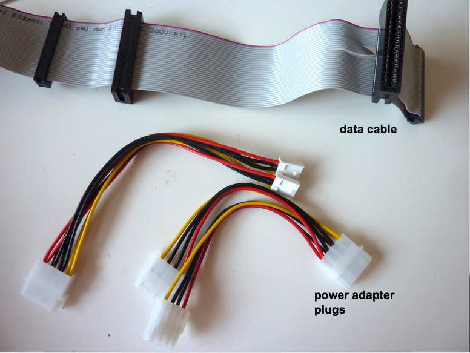
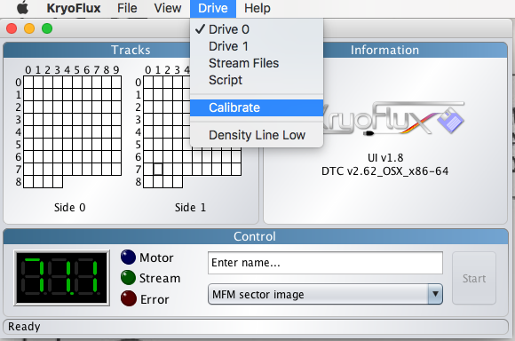
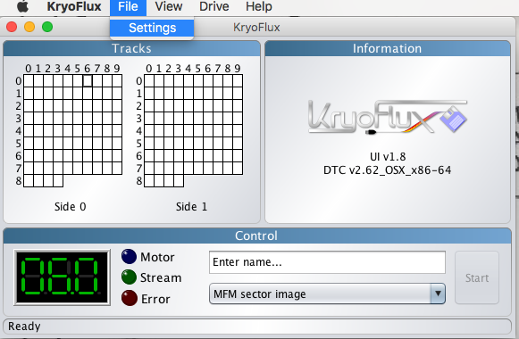
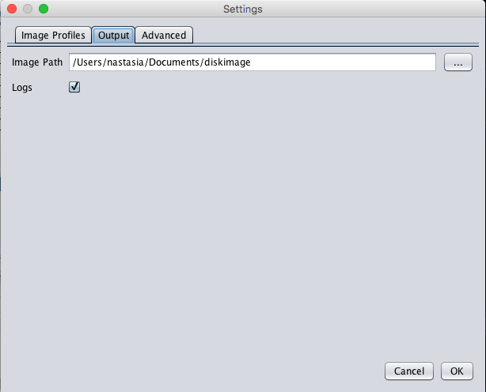
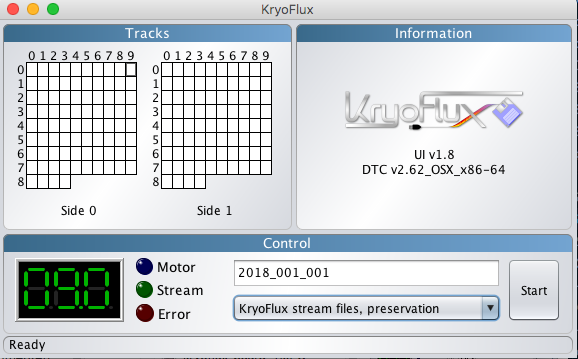
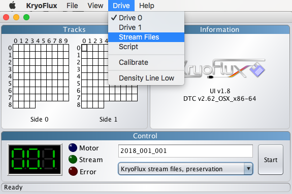
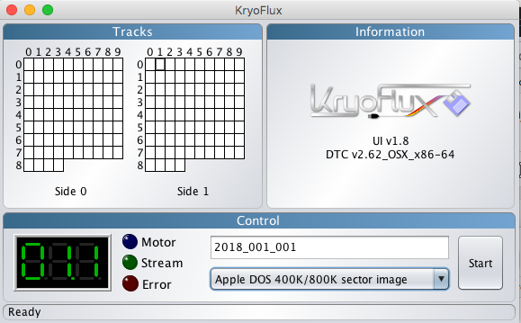
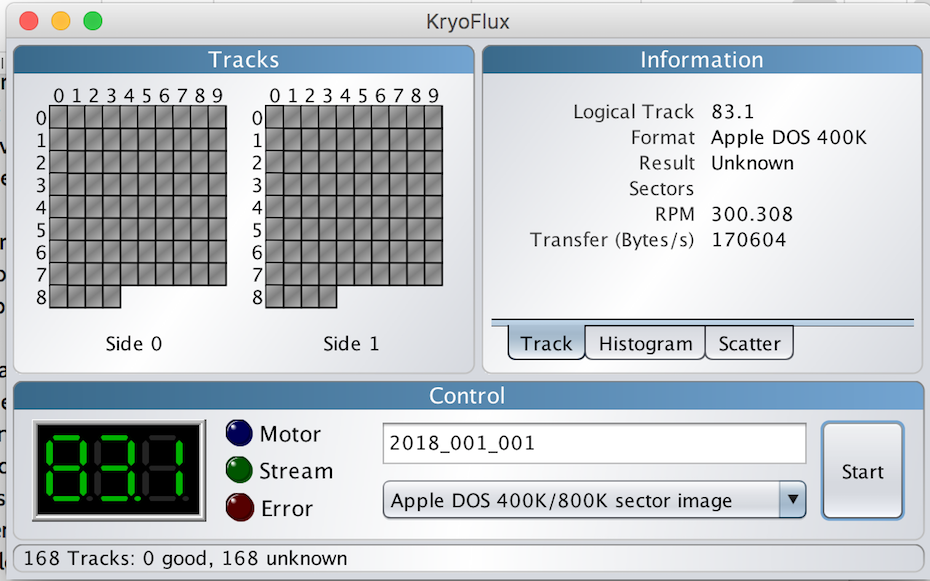
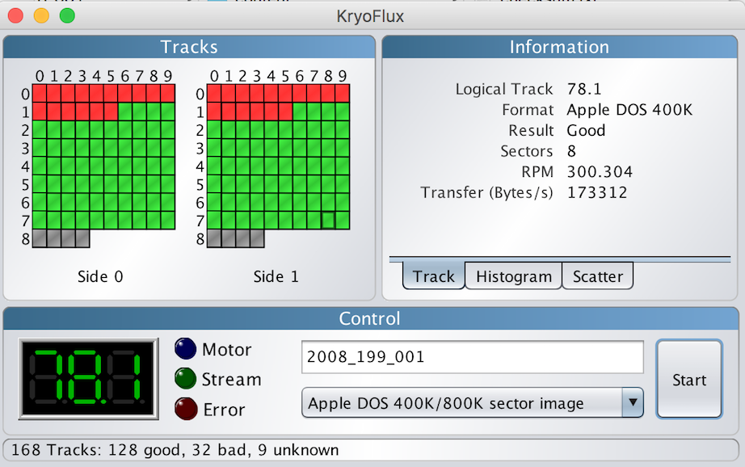

# 3,5 inch Floppy Disks (SD or DD)

For 3,5 inch HD Floppy disks, [follow the workflow with the USB floppy disk drive](3-5-inch-HD.md)

## Hardware

### Floppy Disk Drive

| **Model** | Sony MPF920-E |
|:--|:--|
| **Media** | 3,5 inch floppy disks (SD, DD, HD)|
| **Interface** | [IDC](https://www.wikidata.org/wiki/Q374830) |
| **Connector** | Floppy |
| **Cable** | 3,5 inch [Floppy Data Cable](https://www.computerhope.com/jargon/f/flopcabl.htm) |
| **Workstation connection** | via [Floppy Disk Controller](https://www.wikidata.org/wiki/Q741867) |
| **Power** | Power Supply unit and [Berg connector](https://www.wikidata.org/wiki/Q16951277) |
| **Documentation** | [manual](http://www.vintagecomputer.net/fjkraan/comp/divcomp/doc/YE_Data_YD-380_5.25inchHHHDFloppy.pdf)|

### Floppy Disk Controller

| **Model** | Kryoflux Personal Edition Premium  |
|:--|:--|
| **Media** | All floppy drives with a floppy data cable |
| **Interface** | [USB](https://www.wikidata.org/wiki/Q42378) |
| **Connector** | USB 2.0 |
| **Cable** | [Floppy Data Cable](https://www.computerhope.com/jargon/f/flopcabl.htm) |
| **Workstation connection** | via [Floppy Disk Controller](https://www.wikidata.org/wiki/Q741867) |
| **Power** | n/a (via USB interface) |
| **Documentation** | [Archivist's Guide to Kryoflux](https://github.com/archivistsguidetokryoflux/archivists-guide-to-kryoflux) |

## Software

[Kryoflux DTC](https://www.kryoflux.com/?page=download) (manual: [Archivist's Guide to Kryoflux](https://github.com/archivistsguidetokryoflux/archivists-guide-to-kryoflux))

## Workflow

**!IMPORTANT!** An internal floppy drive is an unstable source of power that can permanently damage the floppy drive controller, follow the correct order when connecting/disconnecting KryoFlux

### Step 1: Connect the internal floppy drive to workstation

1. Connect the floppy data cable to the floppy drive controller. Make sure that the red side of the data cable is on the same side of the USB (pic) 
    
   
2. Place the floppy drive controller on a non-conductive surface, e.g. on a piece of cardboard
3. Connect the floppy disk drive to the floppy drive controller via the floppy data cable (smallest adapter). It's important that you connect the cable correctly to the drive. The red side of the cable should be put in pin 1 and 2 of the floppy disk drive. You can recognize this by a missing pin next to pin 1 and 2. 
    
   
4. Connect the floppy drive controller to the workstation via the USB type A cable 
   
5. Connect the floppy drive to the power supply via the Molex-Y cable (wider adapter plug) 
   
6. Plug the power into an outlet

 
Connection of the 3.5 inch drive to a modern laptop over KryoFlux.

### Step 2: Let the workstation communicate with the Floppy Drive

1. Open the Kryoflux GUI software (`kryoflux-ui.jar`)
2. Choose _Drive_ in the menu and _Calibrate_ the drive 
   
3. Choose the output directory for the disk images and log files in the KryoFlux Software. Select _File_ > _Settings_ and click on the _Output_ tab. Next to _Image Path_, browse to the appropiate path and ensure that the _Logs_ check is checked. Then click _OK_ 
    
   

### Step 3: Prepare the floppy disk

1. Take a floppy disk.
2. Slide the switch on the floppy disk bringing it in read-only state. Look for a tiny black sliding tab in a square hole in the disk's lower left corner. Slide the tab with a pencil or your thubmnail so that the hole is uncoverd. 
   
3. Insert the floppy disk into the drive. Make sure that you insert the floppy disk with the shutter side in the drive and that the side of the floppy disk with the label is facing upwards.

### Step 4: Capture raw content of floppy disk (optional)

Raw content of floppy disks can be captured in Kryoflux by creating streams. This is extremely helpfull if you don't know the logical format of the floppy. You can capture the stream once and then use the stream files to find the correct formatting. This is the safest option, since floppies are fragile. You only need to read out the floppy disk once i.s.o. potentially multiple times.

You can skip this step if you know the [logical format](https://github.com/archivistsguidetokryoflux/archivists-guide-to-kryoflux/blob/master/2%20PART%20TWO%20In-Depth/Disk-Image-Formats.md) of the floppy disk.

1. Enter a unique identifier for the floppy disk. Click on _Enter name..._ and type in the ID. This will become the filename. Don't enter an extension for the filename.
2. Select the image format _KryoFlux stream files, preservation_ from the dropdown list. 
   
3. Enter _Start_. You should see the green _Stream_ indicator flash on and off and see the cells in the _Tracks_ display, on the left of the window, fill with a grey color.

### Step 5: Create a disk image from the raw content

... or from the floppy disk if you haven't created stream files.

1. Configure the KryoFlux Software
   - (only if you created stream files) Select _Drive_ in the KryoFlux menu and choose _Stream Files_.
     
   - Enter a unique identifier by clicking on _Enter name..._ Do not include an extension.
   - Select in the dropdown list the image format for the disk image (see table 1 or [Wikipedia](https://en.wikipedia.org/wiki/List_of_floppy_disk_formats#Logical_formats) for guidelines). If you want to select multiple output formats, you can do so by holding down the _ctrl_ or _cmd_ (mac) while making the selections. 
     
2. Press _Start_. You should see the green _Stream_ indicator flash on and off and see the cells in the _Tracks_ display on the left of the window fill with a green, orange, red and/or grey color.
   - **Green:** The track was imaged successfully
   - **Orange:** The track was imaged succesfully, but is modified since the first formatting. You will likely see this color in archival material. It just means that the owner or user saved and erased files multiple times on the floppy disk.
   - **Red:** The track was not imaged succesfully
   - **Grey:** the KryoFlux software could not determine the status of this track. This may or may not mean a successful read. It could indicate that this track was unformatted or that the wrong format was selected in step 1.
   - Sometimes you can also see a **yellow** colour. This indicates a formatting error.

  
    Kroflux is creating a disk image of a floppy. A correct logical format was chosen.  
    A wrong logical format was chosen.  
    A correct logical format was chosen. The first 16 tracks contain errors.  
    A correct logical format was chosen. Most of the tracks are modified.

### Step 6: Eject the floppy

When the imaging is finished, eject the floppy disk by pressing the small button on the drive.

## Troubleshooting

### Guidelines for choosing the right logical format

**Table 1:** KryoFlux image formats for the most common floppy disk formatting types.

| Physical Media | Computer Family | Kryoflux Image Format |
| :------------- | :-------------- | :-------------------- |
| 3.5 inch DD/HD | DOS/PC          | MFM Sector Image      |
| 3.5 inch DD    | Macintosh       | Apple DOS 400K/800K   |
| 3.5 inch HD    | Macintosh       | MFM Sector Image      |
| 3.5 inch DD/HD | Atari           | MFM Sector Image      |
| 3.5 inch DD/HD | Commodore Amiga | AmigaDOS sector image |
| 3.5 inch DD    | Commodore Business Machine | CBM GCR    |

### Kryoflux won't capture content from the floppy disk

1. The floppy data cable is connected wrongly with the floppy drive. Go back to step 1 _Connect the internal floppy drive to workstation_
2. There is a problem with the floppy drive. Try capturing with a different drive.