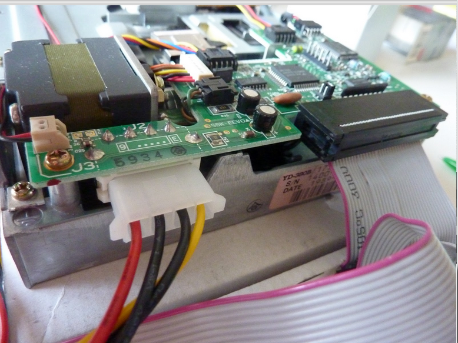

# 5.25 inch Floppy Disks

## Hardware

### Floppy Disk Drive

| **Model** | YE Data YD-380B |
|:--|:--|
| **Media** | 5.25 inch floppy disks |
| **Interface** | [IDC](https://www.wikidata.org/wiki/Q374830) |
| **Connector** | Floppy |
| **Cable** | [Floppy Data Cable](https://www.computerhope.com/jargon/f/flopcabl.htm) |
| **Workstation connection** | via [Floppy Disk Controller](https://www.wikidata.org/wiki/Q741867) |
| **Power** | Power Supply unit and Molex-Y cable |
| **Documentation** | [manual](http://www.vintagecomputer.net/fjkraan/comp/divcomp/doc/YE_Data_YD-380_5.25inchHHHDFloppy.pdf) |

| **Model**  | IBM YD-380 |
|:--|:--|
| **Media** | 5.25 inch floppy disks |
| **Interface** | [IDC](https://www.wikidata.org/wiki/Q374830) |
| **Connector** | Floppy |
| **Cable** | [Floppy Data Cable](https://www.computerhope.com/jargon/f/flopcabl.htm) |
| **Workstation connection** | via [Floppy Drive Controller](https://www.wikidata.org/wiki/Q741867) |
| **Power** | Power Supply unit and Molex-Y cable |
| **Documentation** | [manual](http://www.vintagecomputer.net/fjkraan/comp/divcomp/doc/YE_Data_YD-380_5.25inchHHHDFloppy.pdf) |

### Floppy Drive Controller

| **Model** | KryoFlux Personal Edition Premium [kryoflux](images/kryoflux/Kryoflux_board_clean.JPG)|
|:--|:--|
| **Media** | Drives with floppy data cable |
| **Interface** | [USB](https://www.wikidata.org/wiki/Q42378) |
| **Connector** | USB 2.0 |
| **Cable** | USB type A  |
| **Power** | n/a (via USB interface) |
| **Documentation** | [Archivist's Guide to Kryoflux](https://github.com/archivistsguidetokryoflux/archivists-guide-to-kryoflux) |

## Software

[Kryoflux DTC and GUI](https://www.kryoflux.com/?page=download) (manual: [Archivist's Guide to Kryoflux](https://github.com/archivistsguidetokryoflux/archivists-guide-to-kryoflux))

## Workflow

**!IMPORTANT!** An internal floppy drive is an unstable source of power that can permanently damage the floppy drive controller, follow the correct order when connecting/disconnecting KryoFlux

### Step 1: Connect the internal floppy drive to workstation

1. Connect the floppy data cable to the floppy drive controller. Make sure that the red side of the data cable is on the same side of the USB 
    
   
2. Place the floppy drive controller on a non-conductive surface, e.g. on a piece of cardboard
3. Connect the floppy disk drive to the floppy drive controller via the floppy data cable (widest adapter). It's important that you connect the cable correctly to the drive. The red side of the cable should be put in pin 1 of the floppy disk drive. You can recognize this by a missing pin next to pin 2. 
    
   
4. Connect the floppy drive controller to the workstation via the USB type A cable
5. Connect the floppy drive to the power supply via the Molex-Y cable (wider adapter plug) 
   
6. Plug it into an outlet.

### Step 2: Let the workstation communicate with the Floppy Drive

1. Open the Kryoflux GUI software (`kryoflux-ui.jar`)
2. Choose _Drive_ in the menu and _Calibrate_ the drive 
     
3. Choose the output directory for the disk images and log files in the KryoFlux Software. Select _File_ > _Settings_ and click on the _Output_ tab. Next to _Image Path_, browse to the appropiate path and ensure that the _Logs_ check is checked. Then click _OK_ 
    
   

### Step 3: Prepare the floppy disk

1. Take a floppy disk carefully.
2. Cover the right notch on the floppy disk with tape or a label to disable writing on the floppy disk 
   
3. Insert the floppy into the drive (Read/Write window (see pic below) towards the drive and the side of the label facing upwards) 
   
4. Turn the handle down of the drive. When turning the handle down, the drive starts spinning. This stops when the handle is fully down.

### Step 4: Capture raw content of the floppy disk (optional)

Raw content of floppy disks can be captured in KryoFlux by creating streams. This is extremely helpfull if you don't know the logical format of the floppy. You can capture the stream once and then use the stream files to find the correct formatting. This is the safest option, since floppie disks are fragile. You only need to read out the floppy disk once i.s.o. potentially multiple times.

You can skip this step if you know the [logical format](https://github.com/archivistsguidetokryoflux/archivists-guide-to-kryoflux/blob/master/2%20PART%20TWO%20In-Depth/Disk-Image-Formats.md) of the floppy disk.

1. Enter a unique identifier for your floppy. Click on _Enter name..._ and type in the ID. This will become the filename. Don't enter an extension for the filename.
2. Select the image format _KryoFlux stream files, preservation_ from the dropdown list.
   
3. Enter _Start_. You should see the green _Stream_ indicator flash on and off and see the cells in the _Tracks_ display on the left of the window fill with a grey colour.

### Step 5: Create a disk image from the raw content

... or from the floppy disk if you haven't created stream files.

1. Configure the KryoFlux Software
   - (only if you created stream files) Select _Drive_ in the KryoFlux menu and choose _Stream Files_. 
     
   - Enter a unique identifier by clicking on _Enter name..._ Do not include an extension.
   - Select in the dropdown list the image format for the disk image (see table 1 or [Wikipedia](https://en.wikipedia.org/wiki/List_of_floppy_disk_formats#Logical_formats) for guidelines). If you want to select multiple output formats, you can do so by holding down the _ctrl_ or _cmd_ (mac) while making the selections. 
     
2. Press _Start_. You should see the green _Stream_ indicator flash on and off and see the cells in the _Tracks_ display on the left of the window fill with a green, orange, red and/or grey colour.
   - **Green:** The track was imaged successfully
   - **Orange:** The track was imaged succesfully, but is modified since the first formatting. You will likely see this colour in archival material. It just means that the owner or user saved and erased files multiple times on the floppy disk.
   - **Red:** The track was not imaged succesfully.
   - **Grey:** the KryoFlux software could not determine the status of this track. This may or may not mean a successful read. It could indicate that this track was unformatted or that the wrong format was selected in step 1.
   - Sometimes you can also see a **yellow** colour. This indicates a formatting error.

    Kroflux is creating a disk image of a floppy. A correct logical format was chosen.  
    A wrong logical format was chosen.  
    A correct logical format was chosen. The first 16 tracks on both sides contain errors.  
    A correct logical format was chosen. Most of the tracks are modified.

### Step 6: Eject the floppy disk

When the imaging is finished, eject the floppy disk from the drive.

## Troubleshooting

### Guidelines for choosing the right logical format

**Table:** KryoFlux image formats for the most common floppy disk formatting types.

| Physical Media | Computer Family | Kryoflux Image Format |
| :------------- | :-------------- | :-------------------- |
| 3.5 inch DD/HD | DOS/PC          | MFM Sector Image      |
| 3.5 inch DD    | Macintosh       | Apple DOS 400K/800K   |
| 3.5 inch HD    | Macintosh       | MFM Sector Image      |
| 3.5 inch DD/HD | Atari           | MFM Sector Image      |
| 3.5 inch DD/HD | Commodore Amiga | AmigaDOS sector image |
| 3.5 inch DD    | Commodore Business Machine | CBM GCR    |

### Kryoflux won't capture content from the floppy disk

1. The floppy data cable is connected wrongly with the floppy drive. Go back to [Step 1: Connect the internal floppy drive to workstation](#step-1-connect-the-internal-floppy-drive-to-workstation).
2. There is a problem with the floppy drive. Try a different drive.