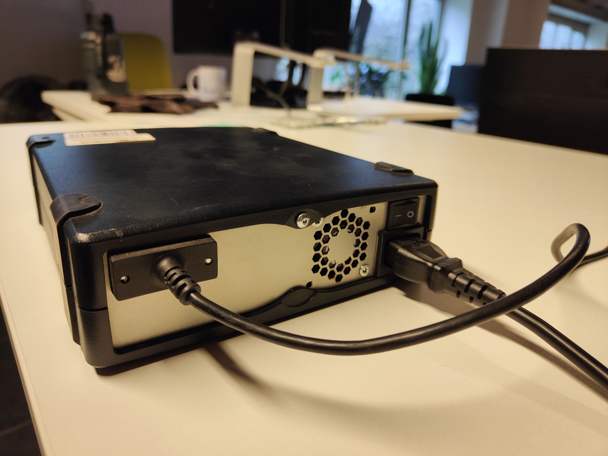
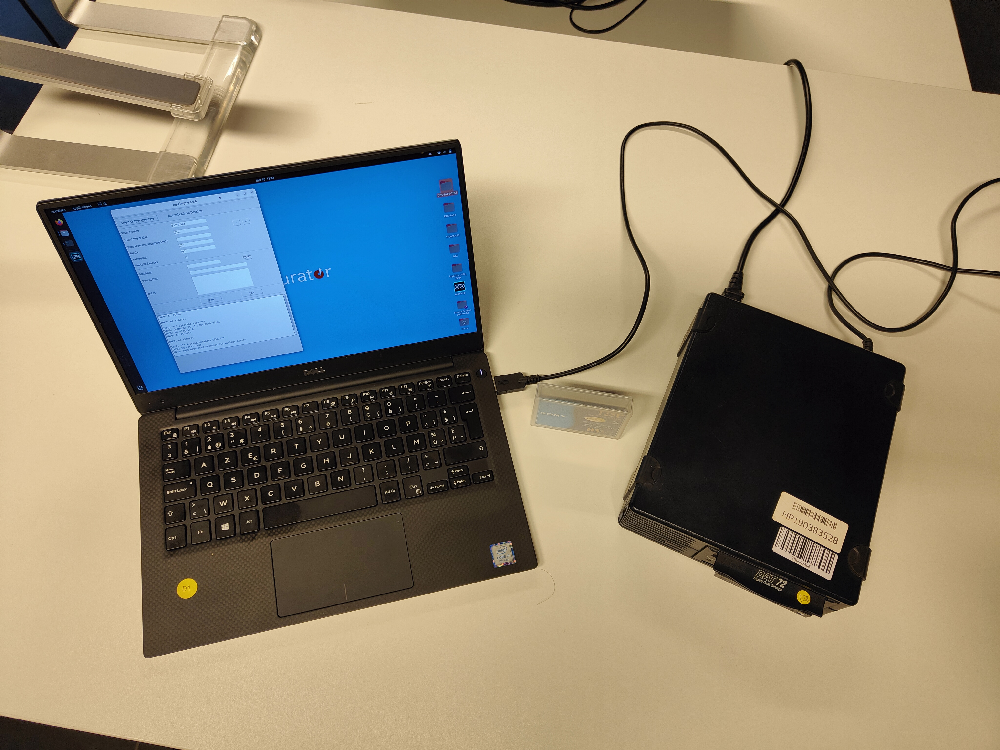
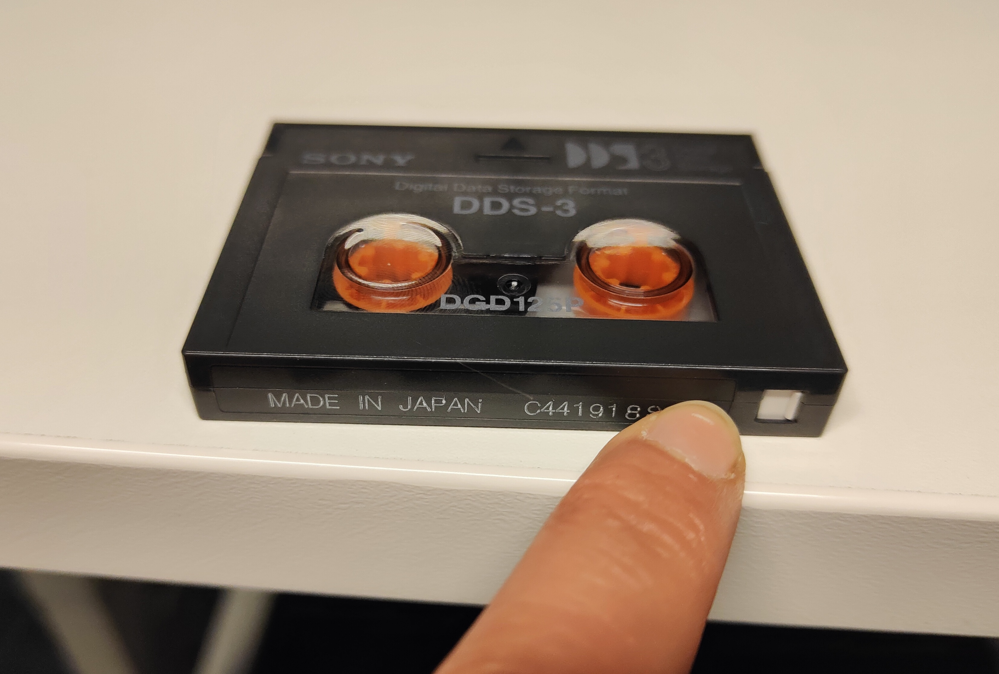
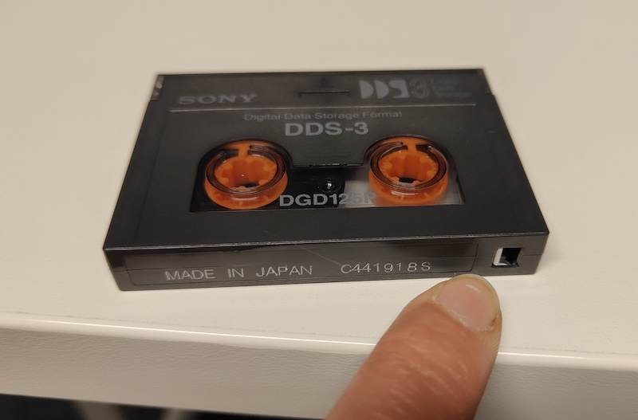
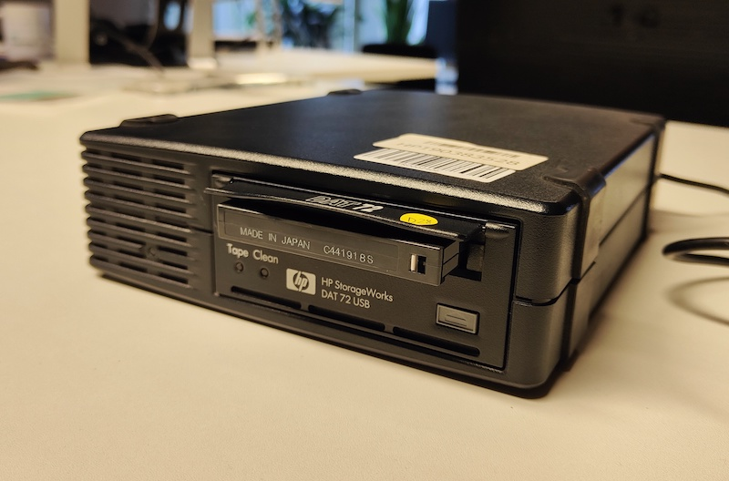
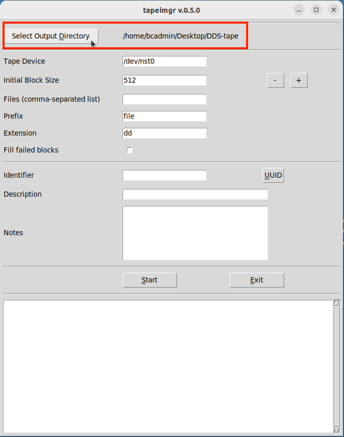
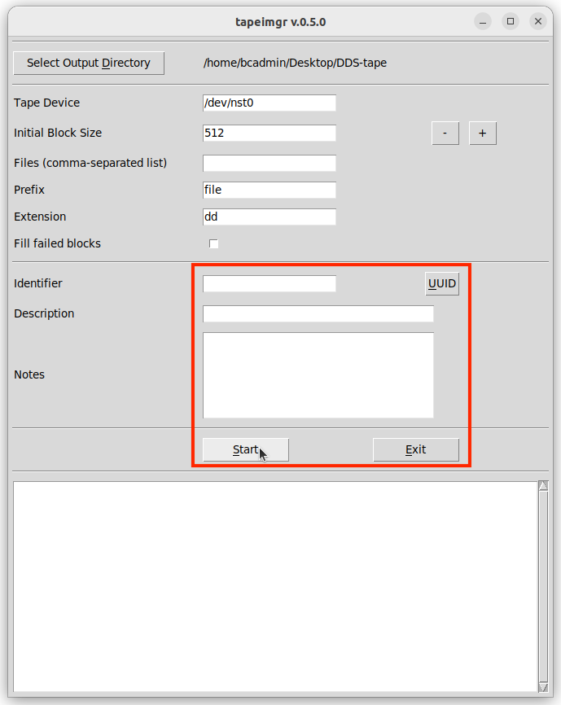
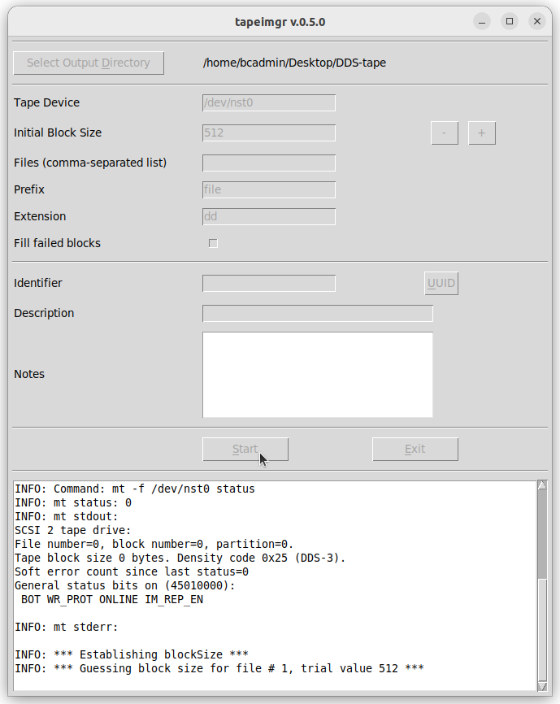
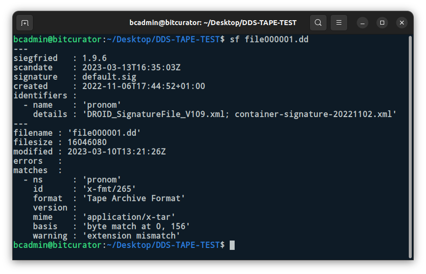

# DDS tapes

## Hardware

### DDS drive

|**Model**|[HP StorageWorks DAT 72 USB](https://www.cnet.com/products/hp-storageworks-dat-72-usb-external-tape-drive-tape-drive-dat-usb/)|
|:--|:--|
|**Media**|DDS-3 tapes DDS-4 tapes DAT 72 or DDS-5 tapes ([Wikipedia](https://en.wikipedia.org/wiki/Digital_Data_Storage))|
|**Interface**|[USB](https://www.wikidata.org/wiki/Q42378)|
|**Connector**|USB 1.1|
|**Cable**|n/a - built in|
|**Workstation connection**|use the built-in cable|
|**Power**| 3 pin shroud female IEC 60320/C13 ([Wikipedia](https://en.wikipedia.org/wiki/IEC_60320#C13/C14_coupler)) |
|**Documentation**| [user guide](https://support.hpe.com/hpsc/doc/public/display?docId=emr_na-c02221551) |

## Software

[Tapeimgr](https://github.com/KBNLresearch/tapeimgr) in the [Bitcurator Environment](https://bitcurator.net/)

## Workflow

### Step 1: Connect the DDS drive to the workstation

1. Use the built-in USB cable to connect the drive to the workstation
2. Attach the power cable to the drive and plug the power cable into a power socket
3. Use the switch on the back of the drive to power on the DDS drive

4. The setup is now ready for use

### Step 2: Prepare the tape

1. Grab the disk you want to capture
2. Slide the switch on the bottom of the tape to the left, bringing it in read-only state
 
3. Insert the tape carefully in the drive
: 

### Step 3: Create an image

> This step doesn't create a disk image as you're used for other media, like hard disks, floppies, jaz disks... Unlike those images, you won't be able to mount te images created of the tape. Tape drives provide sequential access, which means that the data on the disk is being accessed in a predertermined and ordered sequence. An image will be created of every single track/file on the tape. Usually, these files had been created by back-up software.

1. Start Tapeimgr by clicking the shortcut on the Desktop. Tapeimgr is not included in Bitcurator, but is written for the Bitcurator environment. If Tapeimgr is not installed, [you should install it first](https://github.com/KBNLresearch/tapeimgr#installation). 
2. Choose the directory for storing the images by cliking the *Select output directory* button.

3. Add an identifier in the *identifier* field. You can also add a description and some notes about the tape. These data will be stored in a seperate metadata file.

4. Push start. You can follow the proces in the white field at the bottom. When Tapeimgr is finished, a pop-up appears and the tape is ejected from the drive.

5. As a result, you've got the different files/tracks in `.dd`-format, a log, a file with checksums for the different files/tracks and a `metadata.json` file.

### Step 4: Analyse the files

To be able to extract the individual files from the tracks/back-up files, you must know the file format of the back-up files. You can use [Siegfried](https://www.itforarchivists.com/siegfried) or [DROID](https://www.nationalarchives.gov.uk/information-management/manage-information/preserving-digital-records/droid/) for this task. 

In the screenshot below, you can see that the `file0000001.dd` file has the Tape Archive Format (`.tar`). The files can be extracted with the `tar -xvf [file]` or `tar -xcvf [file]` command.

It's also possible that the back-up file is created with proprietary and/or obsolete software. Extracting the files of these back-up files will be much more challenging.

