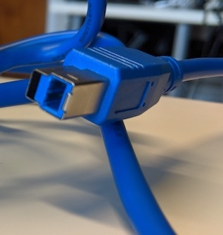

# Magneto-Optical Disks

## Hardware

### M.O. drive

|**Model**|[Fujitsu DynaMO 1300U2 Pocket MDK3130UB](https://web.archive.org/web/20060321071446/http://www.fujitsu.com/global/services/computing/storage/mo/dynamo1300u2pocket/) |
|:--|:--|
|**Media**|M.O. disks 128 MB, 230 MB, 540 MB, 640 MB and 1.3 GB|
|**Interface**|[USB](https://www.wikidata.org/wiki/Q42378)|
|**Connector**|USB 1.1 or 2.0|
|**Cable**|[USB mini B to USB type A](https://commons.wikimedia.org/wiki/File:USB_Mini-B_and_Standard-A_plugs.jpg) |
|**Workstation connection**|Can be connected directly with write blocker (which has a USB type A female connection)|
|**Power**| n/a |
|**Documentation**| |

|**Model**|[Fujitsu DynaMO 2300U2 MDP3230UB](https://web.archive.org/web/20060321071424/http://www.fujitsu.com/global/services/computing/storage/mo/dynamo2300u2al/) |
|:--|:--|
|**Media**|M.O. disks 128 MB, 230 MB, 540 MB, 640 MB, 1.3 GB and 2.3 GB|
|**Interface**|[USB](https://www.wikidata.org/wiki/Q42378)|
|**Connector**|USB 1.1 or 2.0|
|**Cable**|[USB mini B to USB type A](https://commons.wikimedia.org/wiki/File:USB_Mini-B_and_Standard-A_plugs.jpg) |
|**Workstation connection**|Can be connected directly with write blocker (which has a USB type A female connection|
|**Power**| DC input (to check!) |
|**Documentation**| |

### Write blocker

|**Model**|[Tableau Forensic USB 3.0 Bridge T8U](https://web.archive.org/web/20180409191526/https://www.guidancesoftware.com/tableau/hardware//t8u) |
|:--|:--|
|**Media**|Drives with USB 3.0 and older connectors|
|**Interface**|[USB](https://www.wikidata.org/wiki/Q42378)|
|**Connector**|USB 3.0|
|**Cable**|[USB type B to USB type A](https://commons.wikimedia.org/wiki/Category:USB_cables?uselang=nl#/media/File:A-B_Usb_Cable.jpg) |
|**Workstation connection**|Can be connected directly with workstation (which has a USB type A female connection|
|**Power**| DC input: 5-pin Mini-DIN connector |
|**Documentation**| [user guide](https://web.archive.org/web/20230308061552/https://manuals.plus/opentext/t8u-tableau-forensic-usb-bridge-manual) |

### Workstation

A Linux computer, preferably running the [Bitcurator Environment](https://bitcurator.net/) (We use a dual boot Dell XPS)

## Software

[Guymager](https://guymager.sourceforge.io/) in the [Bitcurator Environment](https://bitcurator.net/)

## Workflow

### Step 1: Connect the write blocker to the workstation

1. Connect the write blocker to the workstation using the blue USB 3.0 cable
2. Connect the DC power supply to the write blocker
3. Plug the power cable into a power socket
4. Press the power button on the write blocker

### Step 2: Connect the M.O. Drive to the write blocker

1. Choose the appropriate M.O. Drive.
    - use the Fujitsu DynaMO 1300U2 Pocket for disks with a capacity of 1.3 GB or less
    - Use the Fujitsu DynaMO 2300U2 for disks with a capacity over 1.3 GB
2. Connect the M.O Drive to the write blocker using the USB cable
3. (When using the 2300U2, connect the power cable to the drive and plug the power cable into a power socket)

### Step 3: Prepare the disk

1. Grab the disk of which you want to capture the content
2. Slide the switch on the disk bringing it in read-only state

### Step 4: Create a disk image

1. Insert the M.O. Disk in the M.O. Drive
2. [Create a disk image using Guymager](guymager.md)

### Step 5: Eject the disk

1. Open a file explorer window
2. Right click on the device in the left navigation sidebar
3. Select eject
4. Go back to step 3 using a new disk
