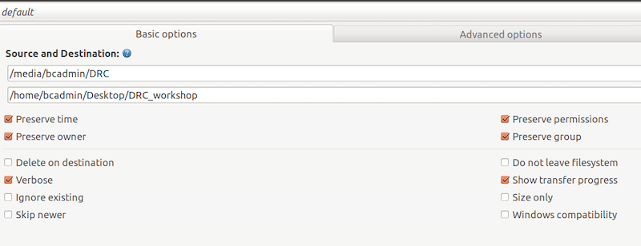

# Safely copy files from disks usings Grsync

Grsync is a GUI alternative for `rsync`. Just like `rsync`, Grsync uses checksums to verify if copied files are identical to their source. `rsync` is a differential backup and file synchronization tool widely used in Unix-like operation systems ([wikipedia](https://en.wikipedia.org/wiki/Grsync))

## Installation

Grsync is included in the Bitcurator environment. You can also easily install it on Debian/Ubuntu computers by using following commands:

```bash
sudo apt update
sudo apt install grsync
```

## Workflow

If you're familiar with the command line and `rsync`, you can also use `rsync`. Remind to use the archive function via `rsync -a`.

1. Start **Grsync** You will find Grsync in the Applications tab undere _Packaging and Transfer_<br>
   
2. Define the Source and Destination under the basic options tab
   - in the first field the path to the source data is expected. Use 'Open' to navigate to the hard drive. You'll find the mounted hard drive under `/media/bcadmin/[name-of-hard-drive]` (only when you're using bitcurator).
   - in the second field, enter the path to the location where the data should be copied.
   - next, check at least following options: **Preserve Time**, **Preserve Owner**,**Preserve Permissions**, **Show Transfer progress**. This options take care that the original metadata of the files will be copied to the destination.<br>
     
3. In the _Advanced options_ menu, check following options: **Always Checksum**, **Preserve Devices**, **Copy simlinks as simlinks** and **Copy hardlinks as hardlinks**. These options also take care that the original metadata is copied and make sure that each copied file is identical to its source.<br>
   
4. Start the transfer by pressing the button with the gear icons in the top right of Grsync.<br>
   <br>
   
5. All files are copied.<br>
   
