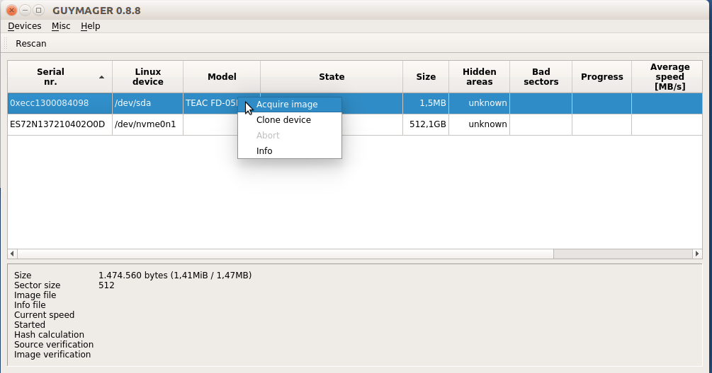

# Creating a disk image using Guymager

Guymager is open source forensic software used for creating disk images of all kinds of devices (e.g. hard disks, floppy disks, optical disks, USB flash drives, etc.). It calculates checksums and verifies if the disk image is identical to the physical disk by using that checksum.

## Installation

Guymager is included in the Bitcurator environment. You can also easily install it on Debian/Ubuntu computers by using following commands:

```bash
sudo apt update
sudo apt install guymager
```

## Workflow

1. Start **Guymager**. You will find Guymager in the Applications tab under _Imaging and Recovery_.
2. Right click on the entry for the drive and select _Acquire image_. You will find most entries under the Linux device (second column) `/dev/sda` or `/dev/sdb` or `/dev/sdc` (depends on the amount of USB devices that are plugged in).<br>
    <br>
    
3. Add following settings in the dialog:
   - **Linux dd raw image** as file format;
   - **uncheck** the **Split image files**;
   - under _Destination_ create a destination directory for the disk image by clicking on the button with **...**;
   - enter a file name for the disk image file in the **Image filename (without extension)** field;
   - under _Hash calculation/verification_ check **Calculate MD5** and **Verify image after acquisition**.
4. Press the start button. Guymager wil start acquiring and verifying the image.<br>
    
5. When Guymager is finished, you'll see a green bullet and the text _Finished - Verified & ok_.<br>
   
6. Navigate to the chosen destination directory in step 4. You will see two files: a disk image with the _.dd_ extension and an information file with the _.info_ extension.


