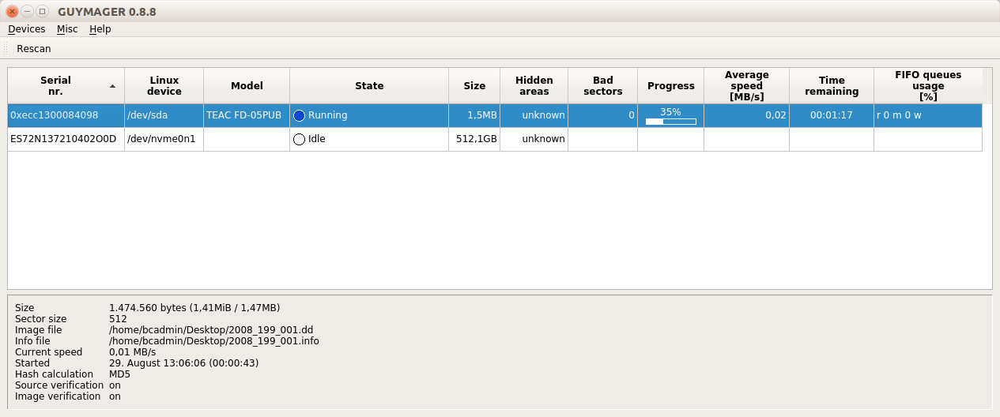
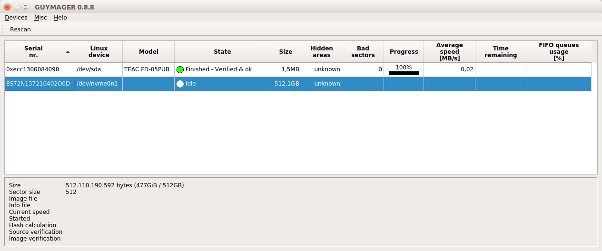
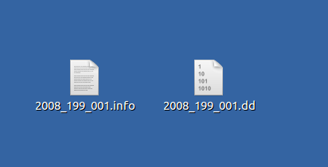

# Hard disks

This manual and setup is meant for hard drives having a IDE and SATA interface. It can also be used for external hard drives, but then you need to remove the enclosure of the hard disk. The IDE or SATA interface is much faster then the USB one. 

This setup can't be used for M2.SATA disks.

## Hardware

There are two possible setups: one where only using a write blocker/bride, one where you'll use a docking station and a write blocker

### Setup #1 - only using a write blocker/bridge

#### Write blocker

|**Model**|[Tableau Forensic USB 3.0 Bridge T8U](https://web.archive.org/web/20180409191526/https://www.guidancesoftware.com/tableau/hardware//t8u) |
|:--|:--|
|**Media**|Drives with SATA or IDE interface|
|**Interface**|<ul><li>[SATA](https://www.wikidata.org/wiki/Q188639)</li><li>[IDE](https://www.wikidata.org/wiki/Q230360)</li></ul>|
|**Connector**|USB 3.0|
|**Cable**|[USB type B to USB type A](https://commons.wikimedia.org/wiki/Category:USB_cables?uselang=nl#/media/File:A-B_Usb_Cable.jpg)|
|**Workstation connection**|Can be connected directly with workstation (which has a USB type A female connection|
|**Power**| DC input: 5-pin Mini-DIN connector|

### Setup #2 - docking station

#### Docking station

|**Model**|[4-Bay USB 3.0 SATA 2.5"/3.5" SSD/HDD Docking Station](https://web.archive.org/web/20230210101406/https://sabrent.com/collections/docking-station/products/ds-u3b4) |
|:--|:--|
|**Media**|2.5" SATA hard disks 3.5" SATA hard disks 2.5" IDE hard disks 3.5" IDE hard disks|
|**Interface**|<ul><li>[SATA](https://www.wikidata.org/wiki/Q188639)</li><li>[IDE](https://www.wikidata.org/wiki/Q230360)</li></ul>|
|**Connector**|USB 3.0|
|**Cable**|USB 3.0 type B to type A|
|**Workstation connection**|Via USB write blocker|
|**Power**| via DC pin |

#### Write blocker

|**Model**|[Tableau Forensic USB 3.0 Bridge T8U](https://web.archive.org/web/20180409191526/https://www.guidancesoftware.com/tableau/hardware//t8u) |
|:--|:--|
|**Media**|Drives with USB 3.0 and older connectors|
|**Interface**|[USB](https://www.wikidata.org/wiki/Q42378)|
|**Connector**|USB 3.0|
|**Cable**|[USB type B to USB type A](https://commons.wikimedia.org/wiki/Category:USB_cables?uselang=nl#/media/File:A-B_Usb_Cable.jpg) |
|**Workstation connection**|Can be connected directly with workstation (which has a USB type A female connection|
|**Power**| DC input: 5-pin Mini-DIN connector |
|**Documentation**| |

### Workstation

A Linux computer, preferably running the [Bitcurator Environment](https://bitcurator.net/) (We use a dual boot Dell XPS)

## Software

There are two possible workflows: one where you create a disk image of the whole disk, or one where you only copy the files on the disk.

### Workflow #1: Guymager

[Guymager](https://guymager.sourceforge.io/) in the [Bitcurator Environment](https://bitcurator.net/) is used to create disk images of hard disks. This implies that you create and identical copy of the hard disk

__Advantages:__
* You've got an identical copy of the disk and also the original environment is preserved, like the history of the files, metadata and file system. Old Macintosh file systems, for example, don't have file extensions to identify files. In stead this information is stored in metadata in the file system. So for old Macintosh file systems, it's important to preserve the original file system.
* Less risk of infections with viruses, because the hard disk is not mounted and individual files are not exported.
* This means also that you cannot remove accidentially an indivual file of the disk.
* Because it's not necessary to mount the hard disk, you can create copy's of hard disks that are damaged, whose file system is not compatible with the workstation or on which you do not have read and write rights.

### Workflow #2: Grsync

[Grsync](http://www.opbyte.it/grsync/) in the [Bitcurator Environment](https://bitcurator.net/) is a GUI alternative to <code>rsync</code>. It is used to copy safely files from one computer to another. (G)rsycn checks by means of checksums if the files are copied correctly and can copy the original metadata (e.g. last modification date) without modification.

__Advantages:__
* You only preserve the actual files on the disk (so no empty space) 
* Which also means that the transfer of the files is faster
* This means also that you cannot remove accidentially an indivual file of the disk.
* (G)rsync is more configurable.  For example, you can provide a list of files or file formats that you do not want to be transferred (e.g. system files).
* <code>rsync</code> is a command line tool and therefore automatable.

__Disadvantages:__
* The original environment of the hard disk will be lost and thus also the metadata that is stored in the file system 
* You cannot use this workflow if the file system of the disk is not compatible with the work station.
* When a hard disk is damaged and cannot be mounted by the workstation, this workflow is not usable.

We prefer creating disk images, but you can use this workflow if you haven't plenty of time and/or if you're working on recent hard disks whose file system is compatible with that of the workstation.

We discourage the use of this workflow if you're working on Mac formatted hard disks.

## Workflow

### Setup #1 - write blocker

#### Step 1: Connect the hard disks to the write blocker

1. Choose the appropriate cable
    - Use the IDE cable when you've got an IDE hard disk
    - Use the SATA cable when you've got a SATA hard disk
2. Connect the hard disk to the write blocker

#### Step 2: Connect the write blocker to the workstation

1. Connect the write blocker to the workstation using the blue USB 3.0 cable
2. Connect the DC power supply to the write blocker
3. Plug the power cable into a power socket
4. Press the power button on the write blocker

#### Step 3: Create a disk image or copy the files

Decide if you want to create a disk image or just copy all the files. We recommend creating a disk image.

##### Option 1 - disk image

1. Start **Guymager**. You will find Guymager in the Applications tab undere _Imaging and Recovery_
2. Right click on the entry for the Hard drive and select _Acquire image_. You will find the Hard drive entry under the Linux device (second column) `/dev/sda`
    
    
3. Add following settings in the dialog:
   - **Linux dd raw image** as file format
   - under _Destination_ create a destination directory for the disk image by clicking on the button with **...**
   - enter a file name for the disk image file in the **Image filename (without extension)** field
   - under _Hash calculation/verification_ check **Calculate MD5** and **Verify image after acquisition**
4. Press the start button. Guymager wil start acquiring and verifying the image
    
5. When Guymager is finished, you'll see a green bullet and the text _Finished - Verified & ok_
   
6. Navigate to the chosen destination directory in step 4. You will see two files: a disk image with the _.dd_ extension and an information file with the _.info_ extension

##### Option 2: Copy all the files with (G)rsync

If you're familiar with the command line and `rsync`, you can also use `rsync`. Remind to use the archive function via `rsync -a`.

1. Start **Grsync** You will find Grsync in the Applications tab undere _Packaging and Transfer_
2. Define the Source and Destination under the basic options tab
   - in the first field the path to the source data is expected. Use 'Open' to navigate to the hard drive. You'll find the mounted hard drive under `/media/bcadmin/[name-of-hard-drive]`.
   - in the second field, enter the path to the location where the data should be copied.
   - next, check at least following options: **Preserve Time**, **Preserve Owner**,**Preserve Permissions**, **Show Transfer progress**. This options take care that the original metadata of the files will be copied to the destination.
3. In the _Advanced options_ menu, check following options: **Always Checksum**, **Preserve Devices**, **Copy simlinks as simlinks** and **Copy hardlinks as hardlinks.
4. Start the transfer by pressing the button with the gear icons in the top right of Grsync.
5. All files are copied.

### Step 5: Eject the disk

1. If the hard disk is mounted, remove it safely
2. Power off the write blocker
3. Disconnect the hard disk from the write blocker
