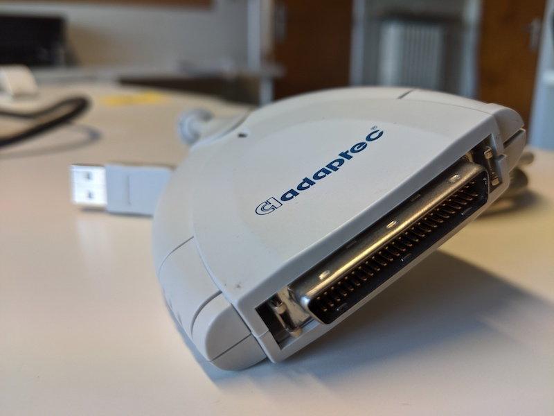

# Jaz disks

## Hardware

### Jaz drive

| **Model** | [Iomega 2GB Jaz drive](https://web.archive.org/web/20210425034320/https://miap.hosting.nyu.edu/program/student_work/2005fall/05f_1805_felixdidier_a2_y.pdf) |
|:--|:--|
| **Media** | Jaz 2 GB Jaz 1 GB |
| **Interface** | [SCSI](https://www.wikidata.org/wiki/Q220868) |
| **Connector** | SCSI-2 DB50 |
| **Cable** | SCSI-2 DB50 to USB type A  |
| **Workstation connection** | Can be connected with write blocker via the cable|
| **Power** | DIN connector  |
| **Documentation** |  |

| **Model** | Iomega 1GB Jaz drive |
|:--|:--|
| **Media** | Jaz 1 GB |
| **Interface** | [SCSI](https://www.wikidata.org/wiki/Q220868) |
| **Connector** | SCSI-2 DB50 |
| **Cable** | SCSI-2 DB50 to USB type A  |
| **Workstation connection** | Can be connected with write blocker via the cable|
| **Power** | DIN connector  |
| **Documentation** |  |

### Write blocker

| **Model** | [Tableau Forensic USB 3.0 Bridge T8U](https://web.archive.org/web/20180409191526/https://www.guidancesoftware.com/tableau/hardware//t8u) |
|:--|:--|
| **Media** | Drives with USB 3.0 and older connectors |
| **Interface** | [USB](https://www.wikidata.org/wiki/Q42378) |
| **Connector** | USB 3.0 |
| **Cable** | [USB type B to USB type A](https://commons.wikimedia.org/wiki/Category:USB_cables?uselang=nl#/media/File:A-B_Usb_Cable.jpg) |
| **Workstation connection** | Can be connected directly with workstation (which has a USB type A female connection |
| **Power** | DC input: 5-pin Mini-DIN connector |
| **Documentation** | [user guide](https://web.archive.org/web/20230308061552/https://manuals.plus/opentext/t8u-tableau-forensic-usb-bridge-manual)  |

### Workstation

A Linux computer, preferably running the [Bitcurator Environment](https://bitcurator.net/) (We use a Dell XPS)

## Software

- [Guymager](https://guymager.sourceforge.io/) in the [Bitcurator Environment](https://bitcurator.net/)

## Workflow

### Step 1: Connect the write blocker to the workstation

1. Connect the write blocker to the workstation using the blue USB 3.0 cable
2. Connect the DC power supply to the write blocker
3. Plug the power cable into a power socket
4. Press the power button on the write blocker

### Step 2: Connect the Jaz Drive to the write blocker

1. Connect the Jaz Drive to the write blocker using the USB cable.
2. Connect the power cable to the drive and plug the power cable into a power socket.

### Step 3: Create a disk image

1. Insert the Jaz Disk in the Jaz Drive
2. [Create a disk image using Guymager](guymager.md)

### Step 4: Eject the disk

1. Push the button on the drive to eject the disk
2. If you can't eject the disk by pushing on the button: power off the jaz drive and the write blocker. Power on again and immediatley push on the eject button.