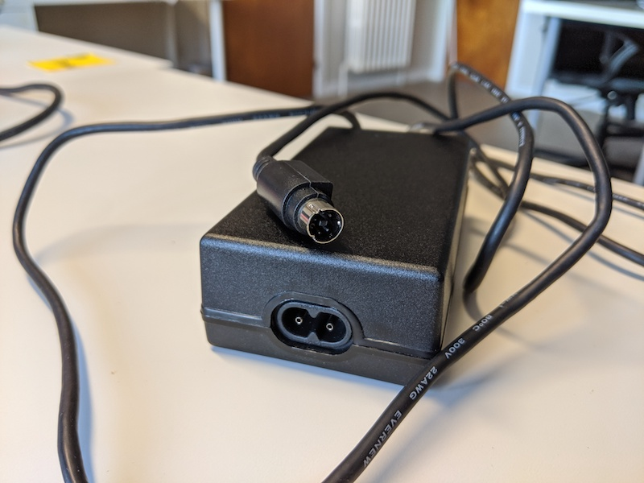

# Jaz disks (still TODO)

## Hardware

### Jaz drive

| **Model**                  | Iomega V2000S External Portable Jaz 2GB SCSI Drive                              |
| :------------------------- | :---------------------------------------------------------------------------------------------------- |
| **Media**                  | Jaz 2 GB and Jaz 1 GB                                                                                 |
| **Interface**              | [SCSI](https://www.wikidata.org/wiki/Q220868)                                                         |
| **Connector**              | SCSI-2 DB50                                                                                           |
| **Cable**                  | SCSI-2 DB50 to USB type A                                             |
| **Workstation connection** | Can be connected directly with write blocker (which has a USB type A female connection) --> to check! |
| **Power**                  | DC input? (to check!)                                                                                 |
| **Documentation**          |                                                                                                       |

### Write blocker

| **Model**                  | [Tableau Forensic USB 3.0 Bridge T8U](https://web.archive.org/web/20180409191526/https://www.guidancesoftware.com/tableau/hardware//t8u)  |
| :------------------------- | :---------------------------------------------------------------------------------------------------------------------------------------------------------------------- |
| **Media**                  | Drives with USB 3.0 and older connectors                                                                                                                                |
| **Interface**              | [USB](https://www.wikidata.org/wiki/Q42378)                                                                                                                             |
| **Connector**              | USB 3.0                                                                                                                                                                 |
| **Cable**                  | [USB type B to USB type A](https://commons.wikimedia.org/wiki/Category:USB_cables?uselang=nl#/media/File:A-B_Usb_Cable.jpg)                     |
| **Workstation connection** | Can be connected directly with workstation (which has a USB type A female connection                                                                                    |
| **Power**                  | DC input: 5-pin Mini-DIN connector                                                                                                  |
| **Documentation**          |                                                                                                                                                                         |

## Software

- [Guymager](https://guymager.sourceforge.io/) in the [Bitcurator Environment](https://bitcurator.net/)

## Workflow

TODO
