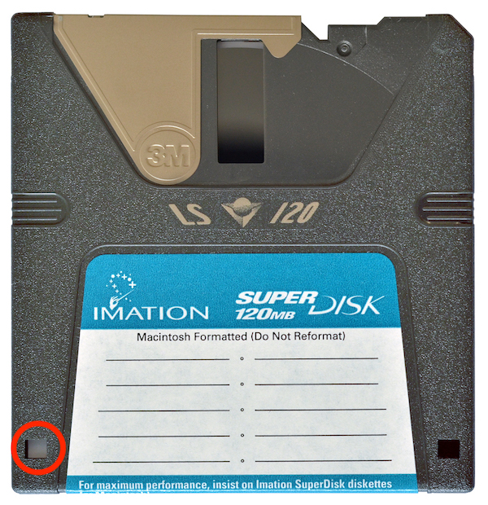

# Imation SuperDisk

## Hardware

### SuperDisk drive

|**Model**|[Imation SuperDisk USB drive](https://web.archive.org/web/20150813195555/http://www.cnet.com/products/imation-superdisk-ls-120-superdisk-drive-usb-series/specs/) |
|:--|:--|
|**Media**|SuperDisk LS-120 3.5 inch IBM formatted double density floppy disk 3.5 inch HD floppy disk|
|**Interface**|[IDE](https://www.wikidata.org/wiki/Q230360)|
|**Connector**|IDE 40 pins|
|**Cable**|IDE to USB adapter cable|
|**Workstation connection**|Can be connected directly with write blocker via IDE USB adapter cable |
|**Power**| Molex connector |
|**Documentation**|[manual](https://drive.google.com/file/d/1YIwcblUgMqgYkJokoOXzxVDIL55mOSBS/view?usp=share_link)|

### Write blocker

|**Model**|[Tableau Forensic USB 3.0 Bridge T8U](https://web.archive.org/web/20180409191526/https://www.guidancesoftware.com/tableau/hardware//t8u) |
|:--|:--|
|**Media**|Drives with USB (3.0 and older) connectors|
|**Interface**|[USB](https://www.wikidata.org/wiki/Q42378)|
|**Connector**|USB 3.0|
|**Cable**|[USB type B to USB type A](https://commons.wikimedia.org/wiki/Category:USB_cables?uselang=nl#/media/File:A-B_Usb_Cable.jpg) |
|**Workstation connection**|Can be connected directly with workstation (which has a USB type A female connection|
|**Power**| DC input: 5-pin Mini-DIN connector |
|**Documentation**| [user guide](https://web.archive.org/web/20230308061552/https://manuals.plus/opentext/t8u-tableau-forensic-usb-bridge-manual) |

### Workstation

A Linux computer, preferably running the [Bitcurator Environment](https://bitcurator.net/) (We use a Dell XPS)

## Software

[Guymager](https://guymager.sourceforge.io/) in the [Bitcurator Environment](https://bitcurator.net/)

## Workflow

### Step 1: Connect the write blocker to the workstation

1. Connect the write blocker to the workstation using the blue USB 3.0 cable (Host USB 3.0)
2. Connect the DC power supply to the write blocker (bottom)
3. Plug the power cable into a power socket
4. Press the power button on the write blocker

### Step 2: Connect the SuperDisk drive to the write blocker

1. Connect the SuperDisk Drive to the write blocker using the USB cable (Device USB 3.0)
2. Connect the DC power supply to the SuperDisk Drive
3. Plug the power cable into a power socket

### Step 3: Prepare the disk

1. Take a SuperDisk.
2. Slide the switch on the disk bringing it in read-only state. Look for a tiny black sliding tab in a square hole in the disk's lower left corner. Slide the tab with a pencil or your thubmnail so that the hole is uncovered.
   [CC BY-SA 4.0](https://creativecommons.org/licenses/by-sa/4.0/deed.en) [Amada44](https://commons.wikimedia.org/wiki/User:Amada44)

### Step 4: Create a disk image

1. Insert the SuperDisk in the SuperDisk Drive
2. [Create a disk image using Guymager](guymager.md)

### Step 5: Eject the disk

1. Press on the button of the SuperDisk Drive to eject the disk
2. If that doesn't work:
   1. Go to the workstation and open a file explorer window 
   2. Right click on the device in the left navigation sidebar
   3. Select eject
   4. Press again on the button of the floppy drive
3. If that doesn't work either:
   1. Power off the write blocker
   2. Power on the write blocker
   3. Immediately press on the button of the SuperDisk drive to eject the SuperDisk.
