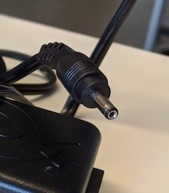

# Zip Disks

## Hardware

### Zip drive

| **Model** | [Iomega Z250 USB PCM](https://web.archive.org/web/20001206101000/http://www.iomega.com/zip/products/usb250.html)  |
|:--|:--|
| **Media** | Zip 100 and Zip 250 disks |
| **Interface** | [USB](https://www.wikidata.org/wiki/Q42378) (or [PCMCIA](https://www.wikidata.org/wiki/Q932506)) |
| **Connector** | USB 1.1 |
| **Cable**  | [USB type B to USB type A](https://commons.wikimedia.org/wiki/Category:USB_cables?uselang=nl#/media/File:A-B_Usb_Cable.jpg)  |
| **Workstation connection** | Can be connected directly with write blocker (which has a USB type A female connection |
| **Power** | DC pin  |
| **Documentation** | |

### Write blocker

| **Model** | [Tableau Forensic USB 3.0 Bridge T8U](https://web.archive.org/web/20180409191526/https://www.guidancesoftware.com/tableau/hardware//t8u)  |
|:--|:--|
| **Media** | Drives with USB 3.0 and older connectors |
| **Interface** | [USB](https://www.wikidata.org/wiki/Q42378) |
| **Connector** | USB 3.0 |
| **Cable** | [USB type B to USB type A](https://commons.wikimedia.org/wiki/Category:USB_cables?uselang=nl#/media/File:A-B_Usb_Cable.jpg)  |
| **Workstation connection** | Can be connected directly with workstation (which has a USB type A female connection |
| **Power** | DC input: 5-pin Mini-DIN connector  |
| **Documentation** | [user guide](https://web.archive.org/web/20230308061552/https://manuals.plus/opentext/t8u-tableau-forensic-usb-bridge-manual) |

### Workstation

A computer running the [Bitcurator Environment](https://bitcurator.net/) (We use a Dell XPS)

## Software

[Guymager](https://guymager.sourceforge.io/) in the [Bitcurator Environment](https://bitcurator.net/)

## Workflow

### Step 1: Connect the write blocker to the workstation

1. Connect the write blocker to the workstation using the blue USB 3.0 cable
2. Connect the DC power supply to the write blocker
3. Plug the power cable into a power socket
4. Press the power button on the write blocker

### Step 2: Connect the Zip Drive to the write blocker

1. Connect the Zip Drive to the workstation using the USB cable
2. Connect the DC power supply to the Zip Drive
3. Plug the power cable into a power socket

### Step 3: Create a disk image

1. Insert a Zip Diks in the Zip Drive
2. [Create a disk image using Guymager](guymager.md)

### Step 4: Eject the disk

1. Open a file explorer window
2. Right click on the device in the left navigation sidebar
3. Select eject
